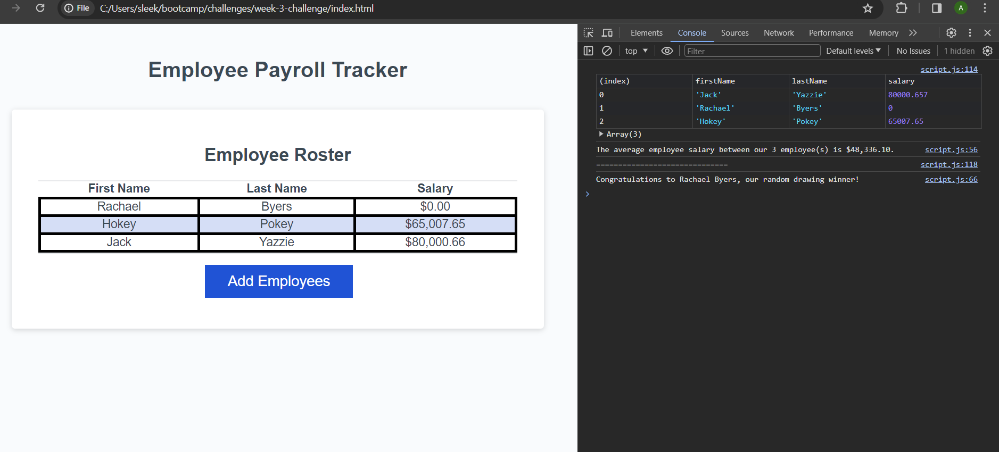

# Javascript Employee Project

Created javascript code to ask for user input, pushing that to an array, so that it could be called on by the table function later in the code. Created an average salary function, and pulled a random employee using the Math.Random function.

## Resources

Used class project examples, and Xpert Learning Assistant.

## Project Screenshot

## Finished Project URL

https://sleekwingx.github.io/week-3-javascript-project-jack-yazzie/